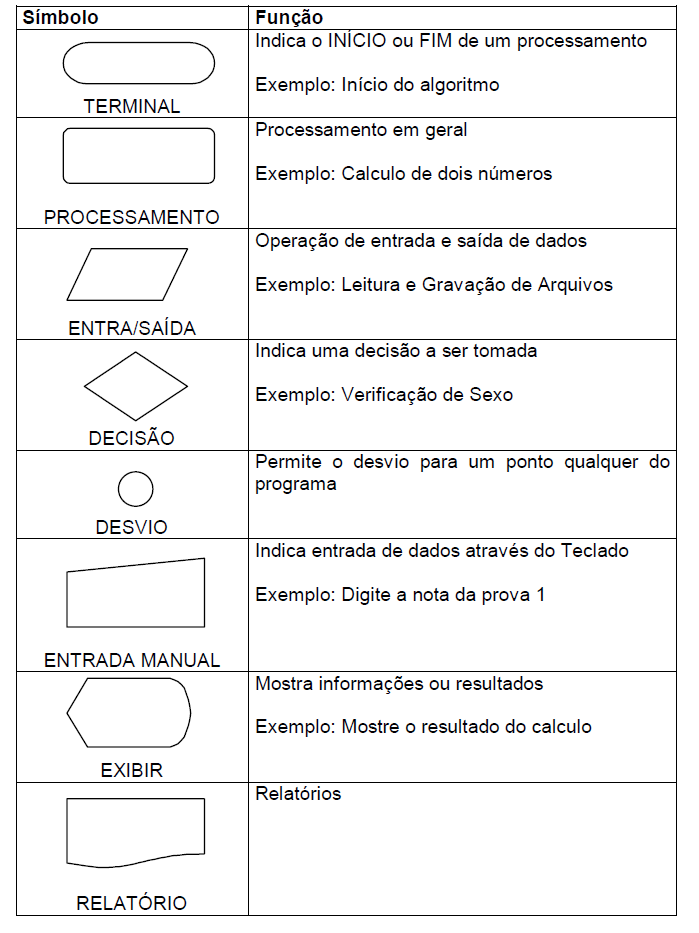
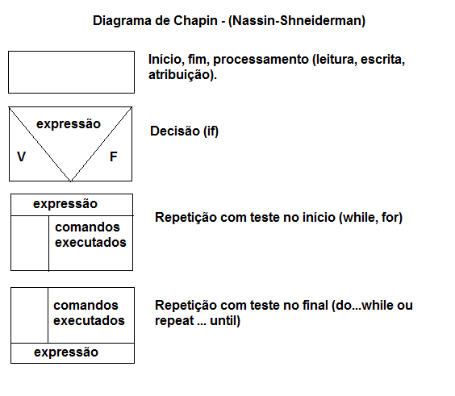

# Aula 1

> ⁉️ **Lógica** é a arte de pensar bem. A técnica de encadear os pensamentos de modo a obter uma conclusão certa, e está normalmente relacionada à coerência e à racionalidade.

> ⁉️ **Algoritmo** é um conjunto finito de instruções que, quando executadas, produzem um resultado.

## Técnicas de desenvolvimento estruturado de algoritmos

- Usar somente um verbo por frase.
- Imaginar que você está desenvolvendo um algoritmo para outras pessoas entenderem.
- Usar frases curtas e simples.
- Ser o mais preciso possível.
- Procurar usar palavras que não tenham ambiguidade.

## Fases na construção de um algoritmo

- **Entrada** - dados de entrada para o algoritmo.
- **Processamento** - procedimentos utilizados para chegar no resultado final.
- **Saída** - dados já processados.

Basicamente são 4 fases na construção de um algoritmo:

1. **Entendimento do problema**.
2. **Criação de uma sequência de operações para solução do problema**.
3. **Execução desta sequência**.
4. **Verificação se o resultado está adequado e solucionou o problema**.

## Formas de representar um algoritmo

- Diagrama de blocos/fluxograma: é uma forma padronizada e eficaz para representar os passos lógicos de um determinado processamento.



- Diagrama de chapin: diagrama que apresenta uma visão hierárquica e estruturada da lógica do programa.



- Português estruturado ou pseudocódigo: é uma linguagem de programação que utiliza palavras-chave para representar as estruturas de controle de um programa.

```
algoritmo "nome do algoritmo"

var
    n1, n2, soma: inteiro;

inicio
    escreva("Digite o primeiro número: ");
    leia(n1);
    escreva("Digite o segundo número: ");
    leia(n2);
    soma <- n1 + n2; // ou soma = n1 + n2
    escreva("A soma dos números é: ", soma);
fim algoritmo
```

- **Variável**: é um espaço na memória do computador que pode ser utilizado para armazenar um valor. O valor armazenado pode ser alterado durante a execução do programa.
- **Expressão**: um conjunto de variáveis e constantes que se relacionam por meio de operadores aritméticos.

## Teste de mesa

Durante a aula foi apresentado dois exemplos de algoritmos para ordenar uma lista de 3 números em ordem cresente. O primeiro algoritmo foi feito baseando-se no algoritmo bubble sort, e o segundo algoritmo foi feito baseando-se no valor mínimo e máximo, calculando por fim o valor do meio.

### Algoritmo 1

```
lista = [8, 5, 3]

> 1º repetição
> 1º comparação -> compara 8 com 5 // + 1 operação = 1
> Como 8 é maior que 5, troca os valores

> 1º 8 é colocado em uma variável auxiliar // + 1 operação = 2
> 2º 5 é colocado no lugar de 8 // + 1 operação = 3
> 3º auxiliar contendo 8 é colocado no lugar de 5 // + 1 operação = 4

------------------------------------------------

> 1º repetição
> 2º comparação -> compara 8 com 3 // + 1 operação = 5
> Como 8 é maior que 3, troca os valores

> 1º 8 é colocado em uma variável auxiliar // + 1 operação = 6
> 2º 3 é colocado no lugar de 8 // + 1 operação = 7
> 3º auxiliar contendo 8 é colocado no lugar de 3 // + 1 operação = 8

------------------------------------------------

> 2º repetição
> 1º comparação -> compara 5 com 3 // + 1 operação = 9
> Como 5 é maior que 3, troca os valores

> 1º 5 é colocado em uma variável auxiliar // + 1 operação = 10
> 2º 3 é colocado no lugar de 5 // + 1 operação = 11
> 3º auxiliar contendo 5 é colocado no lugar de 3 // + 1 operação = 12

------------------------------------------------

O número total de operações foi de 12
```

### Algoritmo 2

```
lista = [8, 5, 3]

atribui ao min o primeiro valor -> 8 // + 1 operação = 1
atribui ao max o primeiro valor -> 8 // + 1 operação = 2

1º repetição

1º comparação -> verifica se 8 é menor que o mínimo 5 // + 1 operação = 3
2º comparação -> verifica se 8 é maior que o máximo 5 // + 1 operação = 4

Como 8 é maior que 5, 8 é o novo máximo // + 1 operação = 5
------------------------------------------------

------------------------------
2º repetição

1º comparação -> verifica se 3 é menor que o mínimo 5 // + 1 operação = 6
Como 3 é menor que 5, 3 é o novo mínimo // + 1 operação = 7
------------------------------------------------

Calcula o meio: (5 + 8 + 3) - (3 + 8) // + 1 operação = 8


Mínimo: 3
Meio: 5
Máximo: 8

O número total de operações foi de 8
```

## Tarefa - meu primeiro algoritmo:

### Escreva o algoritmo para trocar uma lâmpada.

1. Verifique se a lâmpada está acesa, se estiver, apague-a.
2. Verifique se você alcança a lâmpada, se não alcançar, pegue uma escada.
3. Pegue a nova lâmpada.
4. Caso você tenha pego uma escada, suba até o local da lâmpada, caso contrário, vá até o local da lâmpada.
5. Gire a lâmpada para retirar a antiga.
6. Se a nova lâmpada estiver embalada, retire a embalagem.
7. Coloque a nova lâmpada no lugar da antiga, e gire de volta para fixa-lá.
8. Se você tiver pego uma escada, desça da escada.
9. Vá até o interruptor.

### Escreva o algoritmo para somar dois números e mostrar o resultado da soma.

1. Leia o primeiro número.
2. Armazene o primeiro número em uma variável.
3. Leia o segundo número.
4. Armazena o segundo número em uma variável.
5. Some os dois números e armazene o resultado em uma variável.
6. Mostre o resultado da soma.

### Escreva um algoritmo para analisar um número inteiro qualquer e classificar se o número é par ou ímpar.

1. Leia o número.
2. Armazene o número em uma variável.
3. Verifique se o número % 2 é igual a 0.
4. Se for igual a 0, o número é par, caso contrário, o número é ímpar.
