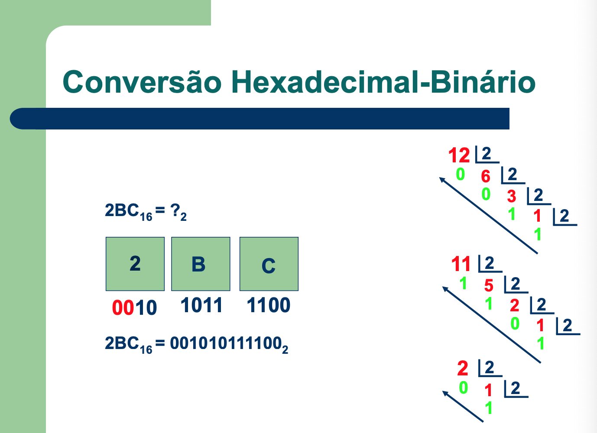

# Aula 2 - Sistema de numeração

> Número é um conceito abstrato que representa a ideia de quantidade.

Sistema de numeração é o conjunto de símbolos utilizados para a representação de quantidade e as regras que definem a forma de representação.

- Não posicional
- Posicional

## Não posicional

Também conhecido como sistema de numeração aditivo, é um método de representação de números em que o valor de cada dígito não depende da posição que ele ocupa, por exemplo o sistema romano.

**Regras**:

- Cada símbolo colocado à direita de um maior é adicionado a este.
- Cada símbolo colocado à esquerda de um maior tem o seu valor subtraído do maior.

Por exemplo, o número 24 é representado em romano como `XXIV`, que significa 10 + 10 - 1 + 5 = 24;

## Posicional

O sistema de numeração posicional é um método de representação numérica em que o valor de um dígito depende da posição em que ele se encontra na sequência. Do ponto de vista numérico, o homem lida com o **sistema decimal**.

### Sistema decimal

- Base 10: possui 10 símbolos diferentes
- Elementos: 0, 1, 2, 3, 4, 5, 6, 7, 8, 9
- Posicional

Embora o sistema decimal possua somente dez símbolos, qualquer número acima disso pode ser expresso usando o sistema de peso por posicionamento. O peso do dígito depende do seu posicionamento. Quanto mais próximo da extrema esquerda do número estiver o dígito, maior será a potência de dez que estará multiplicando o mesmo, ou seja, mais significativo será o digito.

### Sistema binário

É o sistema de numeração mais utilizado em processamento de dados digitais, por apresentar apenas dois algarismos (0 e 1), sendo portando mais fácil de ser representado por circuitos eletrônicos (onde os digitos correspondem a tensões elétricas).

- Base 2: possui 2 símbolos diferentes
- Elementos: 0 e 1
- Posicional

Embora o **sistema binário** possua somente 2 símbolos, qualquer número acima disso pode ser expresso usando o sistema de peso por posicionamento, conforme o exemplo:

1 x 22 + 0 x 21 + 1 x 20 = 4 + 0 + 1 = 5

101 (binário) = 5 (decimal)

Os dígitos binários chamam-se BITS (Binary Digit). Assim como no sistema decimal, dependendo do posicionamento, o algarismo terá um peso. O bit da extrema esquerda será o bit mais significativo e da extrema direita será o bit menos significativo (de maior e menor valor).

O conjunto de 8 bits é denominado Byte.

### Sistema octal

Os números octais foram criados como um sistema de numeração alternativo ao sistema decimal, para ser usado em áreas como a informática, onde é comum trabalhar com grupos de 8 bits (chamados de bytes). O sistema octal é considerado mais compacto e fácil de trabalhar do que o sistema binário, pois em vez de representar cada dígito individualmente, como é feito no sistema binário, é possível representar grupos de três digitos binários em um único símbolo octal.

- Base 8: possui 8 símbolos diferentes
- Elementos: 0, 1, 2, 3, 4, 5, 6, 7
- Posicional

7 x 82 + 4 x 81 + 2 x 80 = 448 + 32 + 2 = 482

742 (octal) = 482 (decimal)

### Sistema hexadecimal

O sistema hexadecimal (base 16) foi criado com o mesmo propósito do sistema octal, o de minimizar a representação de um número binário.

- Base 16: possui 16 símbolos diferentes
- Elementos: 0, 1, 2, 3, 4, 5, 6, 7, 8, 9, A, B, C, D, E, F
- Posicional

1 x 162 + 2 x 161 + B x 160 = 256 + 32 + 11 = 299

12B (hexadecimal) = 299 (decimal)

### Conversões entre os sistemas de numeração posicionais

Teorema fundamental da numeração - relaciona uma quantidade expressa em um sistema de numeração qualquer com a mesma quantidade no sistema decimal.

N = dn-1 x bn-1 + ... + d1 x b1 + d0 x b0

Onde:

- d = dígito
- n = posição
- b = base

### Tabela de conversão de números

| Decimal | Binário | Octal | Hexadecimal |
| ------- | ------- | ----- | ----------- |
| 0       | 0       | 0     | 0           |
| 1       | 1       | 1     | 1           |
| 2       | 10      | 2     | 2           |
| 3       | 11      | 3     | 3           |
| 4       | 100     | 4     | 4           |
| 5       | 101     | 5     | 5           |
| 6       | 110     | 6     | 6           |
| 7       | 111     | 7     | 7           |
| 8       | 1000    | 10    | 8           |
| 9       | 1001    | 11    | 9           |
| 10      | 1010    | 12    | A           |
| 11      | 1011    | 13    | B           |
| 12      | 1100    | 14    | C           |
| 13      | 1101    | 15    | D           |
| 14      | 1110    | 16    | E           |
| 15      | 1111    | 17    | F           |
| 16      | 10000   | 20    | 10          |

### Conversão decimal-binário

- Dividir sucessivamente por 2 o número decimal e o quocientes que vão sendo obtidos.
- O resultado é a sequência de baixo para cima do último quociente mais todos os restos obtidos.

Convertendo o número 10 (decimal) em binário.

- 10 / 2 = 5, resto **0**
- 5 / 2 = 2, resto **1**
- 2 / 2 = **1**, resto **0**

Via de regra, o último quociente é 0 e o último resto é 1. O resultado é a sequência de baixo para cima do último quociente mais todos os restos obtidos. Como o resultado da última divisão inteira foi 1, será o primeiro digito binário, sendo assim o número binário de 10 decimal é 1010.

Convertendo o número 29 (decimal) em binário.

- 29 / 2 = 14, resto **1**
- 14 / 2 = 7, resto **0**
- 7 / 2 = 3, resto **1**
- 3 / 2 = **1**, resto **1**

29 (decimal) = 11101 (binário)

### Conversão decimal-octal

- Dividir sucessivamente por 8 o número decimal e o quocientes que vão sendo obtidos.
- O resultado é a sequência de baixo para cima do último quociente mais todos os restos obtidos.

Convertendo o número 157(decimal) em octal

- 157 / 8 = 19, resto **5**
- 19 / 8 = 2, resto **3**
- 2 / 8 = **0**, resto **2**

157 (decimal) = 235 (octal)

### Conversão decimal-hexadecimal

- Dividir sucessivamente por 16 o número decimal e o quocientes que vão sendo obtidos.
- O resultado é a sequência de baixo para cima do último quociente mais todos os restos obtidos.

Convertendo o número 1000(decimal) em hexadecimal

- 1000 / 16 = 62, resto **8**
- 62 / 16 = **3**, resto **14** (E)
- 14 / 16 = 0, resto 14

1000 (decimal) = 3E8 (hexadecimal)

### Conversão binário-octal

Dividir o número binário em grupos de 3 bits, iniciando da direita para a esquerda e depois converter cada grupo em decimal. Juntando o resultado de cada grupo, obtemos o número octal.

Convertendo o número 10101100(binário) em octal

| 27 | 26 | 25 | 24 | 23 | 22 | 21 | 20 |
| ------------- | ------------- | ------------- | ------------- | ------------- | ------------- | ------------- | ------------- |
| 128           | 64            | 32            | 16            | 8             | 4             | 2             | 1             |
| 1             | 0             | 1             | 0             | 1             | 1             | 0             | 0             |

`010 101 100`

010 = 2 (decimal)
101 = 5 (decimal)
100 = 4 (decimal)

10101100 (binário) = 254 (octal)

### Conversão binário-hexadecimal

Dividir o número binário em grupos de 4 bits, iniciando da direita para a esquerda e depois converter cada grupo em decimal. Juntando o resultado de cada grupo, obtemos o número hexadecimal.

Convertendo o número 100101100(binário) em hexadecimal

| 27 | 26 | 25 | 24 | 23 | 22 | 21 | 20 |
| ------------- | ------------- | ------------- | ------------- | ------------- | ------------- | ------------- | ------------- |
| 128           | 64            | 32            | 16            | 8             | 4             | 2             | 1             |
| 1             | 0             | 0             | 1             | 0             | 1             | 1             | 0             |

`0001 0010 1100`

0001 = 1 (decimal)
0010 = 2 (decimal)
1100 = C (decimal)

100101100 (binário) = 12C (hexadecimal)

### Conversão hexadecimal-binário

O número 2BC em hexadecimal para binário.

- 2 = 0010
- B = 1011
- C = 1100

2: 2 / 2 = **1**, resto **0** - 10 ou (0010)

B: 11 / 2 = 5, resto **1**
5 / 2 = 2, resto **1**
2 / 2 = **1**, resto **0** - 1011 ou (1011)

C: 12 / 2 = 6, resto **0**
6 / 2 = 3, resto **0**
3 / 2 = **1**, resto **1** - 1100 ou (1100)

### Conversão octal-hexa

Dois passos:

- Converter octal para binário.
- Converter binário para hexa.

### Conversão hexa-octal

Dois passos:

- Converter hexa para binário.
- Converter binário para octal.
