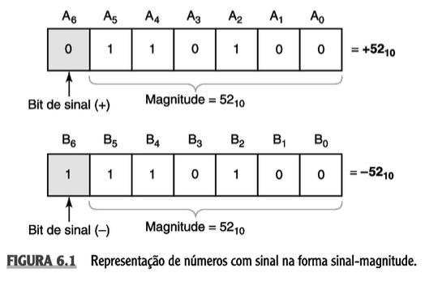

# Aula 3 - Sinal-magnitude e complemento de 2

## Representação numérica

### Números binários sinalizados

Qualquer número pode ser representado no sistema binário. Para os casos em que é necessário representar números inteiros sinalizados, o bit mais significativo do número binário é utilizado para indicar se o número é positivo ou negativo.

### Representação em sinal-magnitude

A forma mais simples de representar números binários sinalizados é utilizando o **sinal-magnitude**. Este tipo de representação utiliza o bit mais significativo para determinar o sinal. Se o bit tem valor então o número é negativo, caso contrário, positivo.

Por exemplo, considere o valor 2 representado com 5 bits (4 para representar o valor e 1 bit para o sinal).

**1**0010 = -2<sub>10</sub>

onde o bit mais significativo é 1, indicando que o número é negativo.



Embora simples, a representação traz algumas desvantagens. Uma delas é que existem duas representações para o valor zero, isto é, um zero positivo e outro negativo.

| Binário | sem sinal | com sinal |
| ------- | --------- | --------- |
| 000     | 0         | 0         |
| 001     | 1         | 1         |
| 010     | 2         | 2         |
| 011     | 3         | 3         |
| 100     | 4         | -0        |
| 101     | 5         | -1        |
| 110     | 6         | -2        |
| 111     | 7         | -3        |

Outra desvantagem é que operações aritméticas realizadas em hardware exigem um esforço a mais para determinar os sinais dos números.

### Representação em complemento

Para chegar no complemento de dois, antes é necessário conhecer o complemento de 1, que nada mais é do que a inversão de cada bit que compõem o número binário.

#### Complemento de 1

(42)<sub>10</sub> = 00101010<sub>2</sub>
(-42)<sub>10</sub> = 11010101<sub>2</sub>

#### Complemento de 2

Na representação em complemento de 2 os problemas relacionados a representação do valor zero e a de determinação dos sinais dos números são eliminadas. Para saber se um número é negativo ou positivo basta testar o bit mais significativo, se o valor é 1 então o número é negativo, caso contrário, é positivo. A forma como os bits são interpretados nessa representação difere no sinal-magnitude. Em complemento para dois, há apenas um zero.

A técnica complemento de dois consiste em inverter cada bit do número binário (complemento de um) e depois somar o bit 1 ao número binário obtido.

```
Número           => 11001010
Complemento de 1 => 00110101
Soma 1:          =>       +1
Complemento de 2 => 00111010
```

Portanto, basta inverter os bits e somar 1 para obter o complemento de dois de um número binário.
